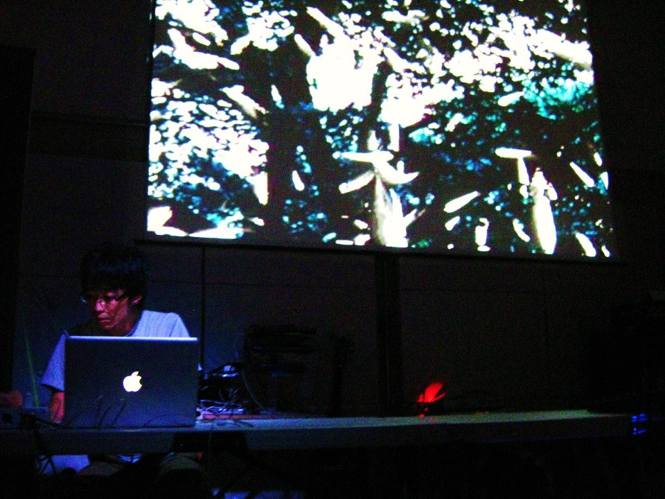

Naoya Sato [noine] is an electronic music artist in Tokyo (Suburb),Japan.Has participated as member of “Trivialism Circle” in 2001. And performed with Max - MSP, playing guitar, harmonica among others. Now "on sunday recordings" member. Sound Engineer(mixing,Mastering),electronic music composer.Improvisation using MAX,Ableton Live,guitar,bass, and harmonica among others.

Recently, I have also been working on design and video production.

